#  RoastMyIdea

<p align="center"></p>

**Authors:** Achyut Katiyar, Soni Rusagara

**Class:** CS5610 Web Development — [https://johnguerra.co/classes/webDevelopment_online_spring_2026/](https://johnguerra.co/classes/webDevelopment_online_spring_2026/)

## Table of Contents

- [Project Objective](#project-objective)
- [Screenshots](#screenshots)
- [Design Document](#design-document)
- [Usability Study](#usability-study)
- [Live Demo](#live-demo)
- [Demo Video](#demo-video)
- [Presentation](#presentation)
- [Tech Stack](#tech-stack)
- [Database](#database)
- [How to Use](#how-to-use)
- [Instructions to Build](#instructions-to-build)
- [API Endpoints](#api-endpoints)
- [MongoDB Collections](#mongodb-collections)
- [Gen AI Usage](#gen-ai-usage)

## Project Objective

RoastMyIdea is a community platform where users pitch startup ideas, side projects, or any concept and the internet decides if they are worth building. Users roast ideas with critiques, defend them with counter-arguments, and back them with virtual RoastCoin. After 7 days a verdict is revealed: FIREPROOF, TORCHED, or LUKEWARM. Fireproof ideas pay out 1.5x to backers, torched ideas lose their stake, and lukewarm ideas get refunded.

## Screenshots

| Page                | Preview                                                  |
| ------------------- | -------------------------------------------------------- |
| Logged out browse   | 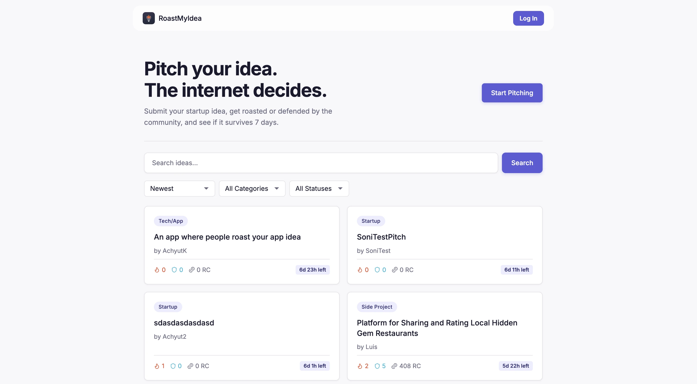 |
| Logged in browse    | 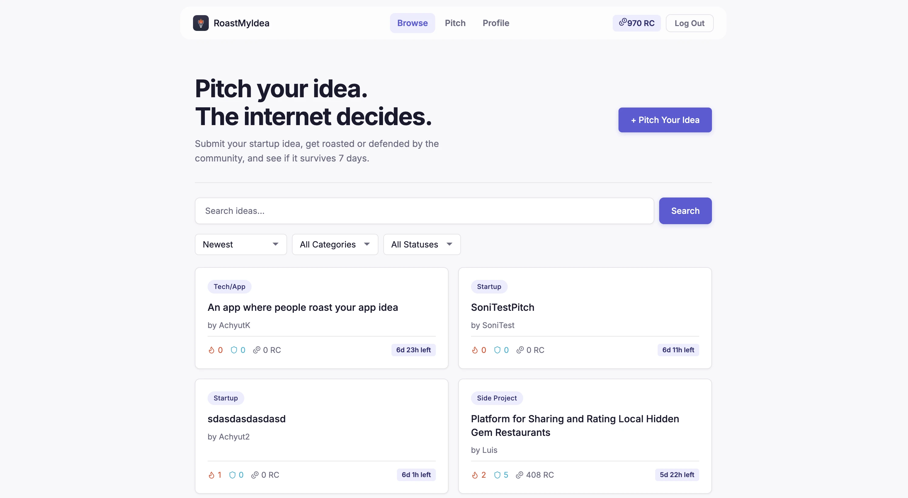   |
| Ideas page          | 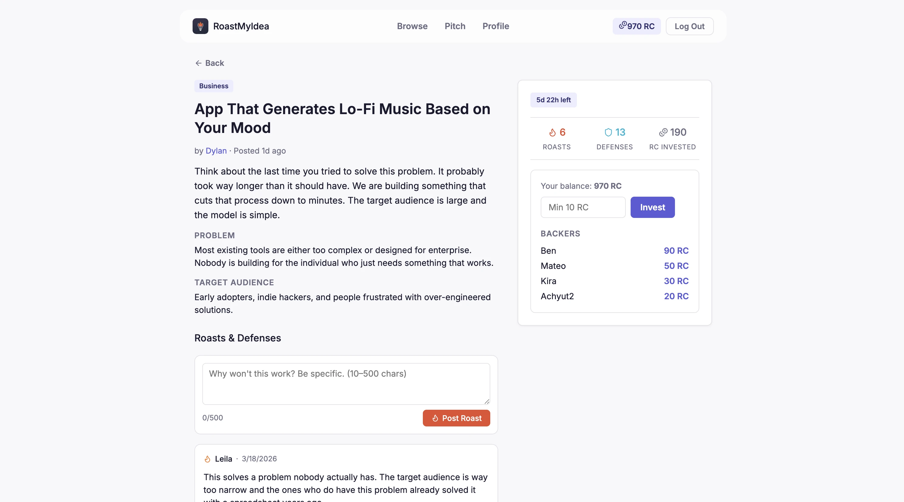               |
| Log in              | 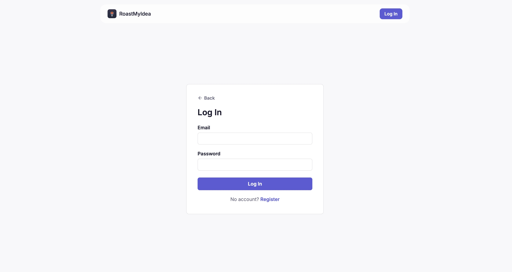                        |
| Sign up             | 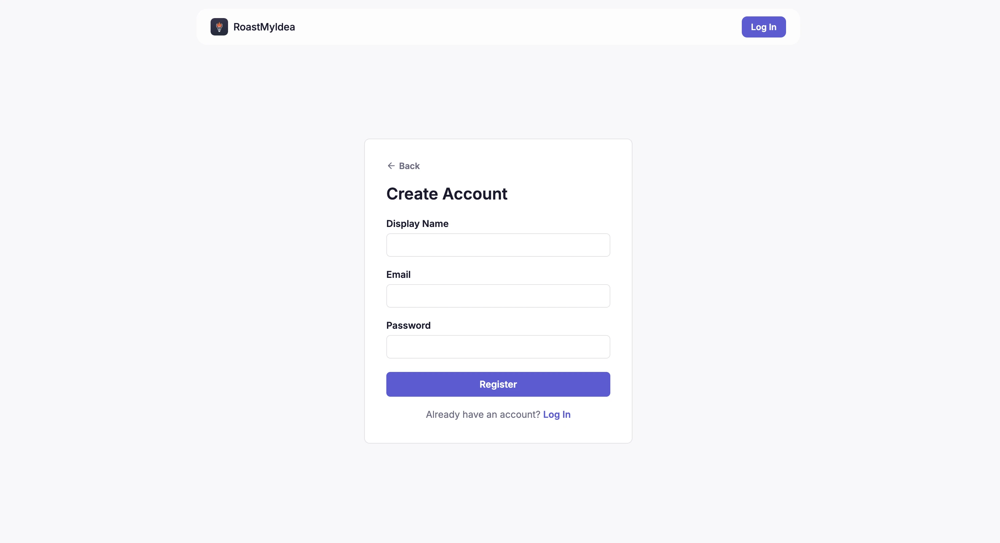                      |
| Pitch               | 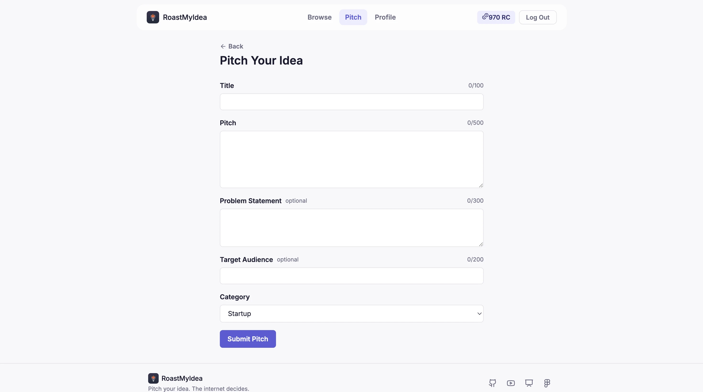                         |
| Profile             | 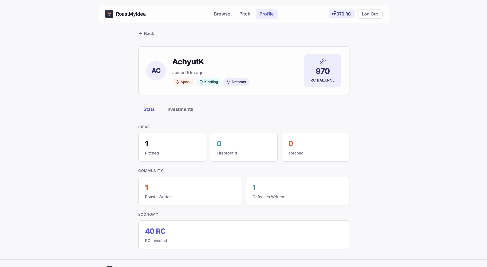                     |
| MongoDB collections | 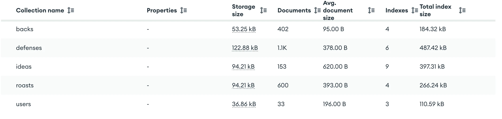         |

## Design Document

[View the full Design Document](https://github.com/Achyut21/roastmyidea/blob/main/docs/RoastMyIdea%20Design%20Document.pdf) including project description, user personas, user stories, design mockups and technical decisions.

[View Wireframes on Figma](https://www.figma.com/design/yYo7Sp8kBIOD0Now5FP4eH/RoastMyIdea?node-id=0-1&t=bpeWTdcMzqWolV9r-1)

## Usability Study

[View the full Usability Study Report](https://github.com/Achyut21/roastmyidea/blob/main/docs/RoastMyIdea%20Usability%20Study%20Report.pdf) — 3 moderated usability sessions conducted by Achyut Katiyar covering browsing, investing, roasting, and profile tasks. Includes per-participant Likert scores, timestamped friction observations, and a prioritized list of 10 issues with recommended changes.

**Participants:** Jake (developer, hackathon pitcher), Robin (international student, Venture Discovery alumnus), James (CS student, HCI background)

**Key findings:**
- Roast count badge did not update after posting (fixed)
- Filter dropdowns reset on every change (fixed)
- RoastCoin economy and payout mechanics were unclear to all 3 participants
- Side-lock constraint (can't switch between roasting and defending) confused 2 participants
- Invest button had no confirmation step — 1 participant double-invested accidentally

## Live Demo

[Deployed on Vercel](https://roastmyidea-nine.vercel.app/)

## Demo Video

[Watch on YouTube](https://www.youtube.com/watch?v=GuO2fjYOHPE)

## Presentation

[View Presentation on Canva](https://www.canva.com/design/DAHEb2l0pZ4/m2r9RFUiHWc7poiUrXUuFA/edit?utm_content=DAHEb2l0pZ4&utm_campaign=designshare&utm_medium=link2&utm_source=sharebutton)

## Tech Stack

Node.js, Express (ESM), MongoDB (native driver), React 18 + Vite, Passport.js + JWT, bcrypt

## Database

The app uses MongoDB Atlas with five collections: users, ideas, roasts, defenses, and backs. The database is seeded with over 2200 records including 30 users, 150 ideas with unique titles, and hundreds of roasts, defenses, and investments.

## How to Use

**Step 1: Create an account.** Click "Log In" in the navbar, then switch to "Register". Enter a display name, email, and password. You will start with 1000 RoastCoin.

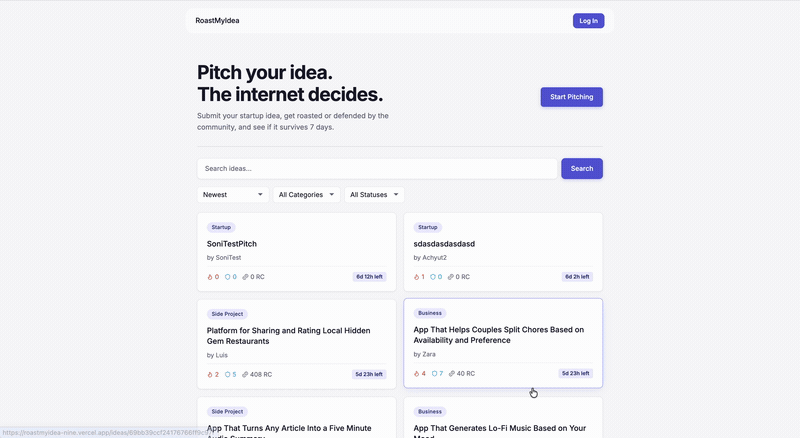

**Step 2: Browse ideas.** The home page shows all pitched ideas. Use the search bar to find ideas by keyword. Use the dropdowns to filter by category, status, or sort by newest, most invested, most roasted, or ending soon.

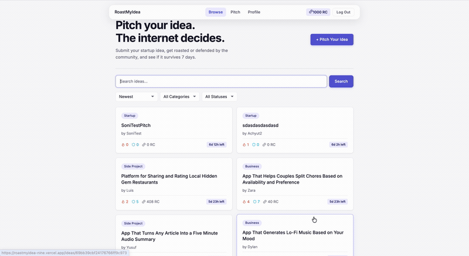

**Step 3: Read an idea.** Click any card to open the idea detail page. The left side shows the full pitch, problem statement, and target audience. The right sidebar shows the verdict timer, stats, and the invest widget.

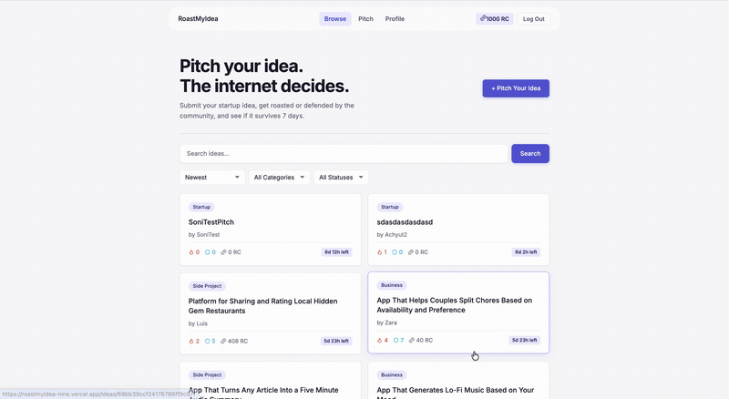

**Step 4: Invest RoastCoin.** On an open idea's detail page, enter an amount (minimum 10 RC) and click Invest. If the idea ends FIREPROOF your stake returns at 1.5x. TORCHED ideas lose the stake. LUKEWARM ideas refund it.

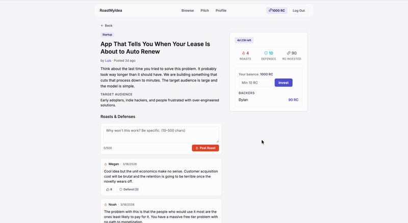

**Step 5: Post a roast.** Scroll down on any idea detail page to the Roasts & Defenses section. Write a critique of at least 10 characters and click Post Roast. You cannot roast your own idea.

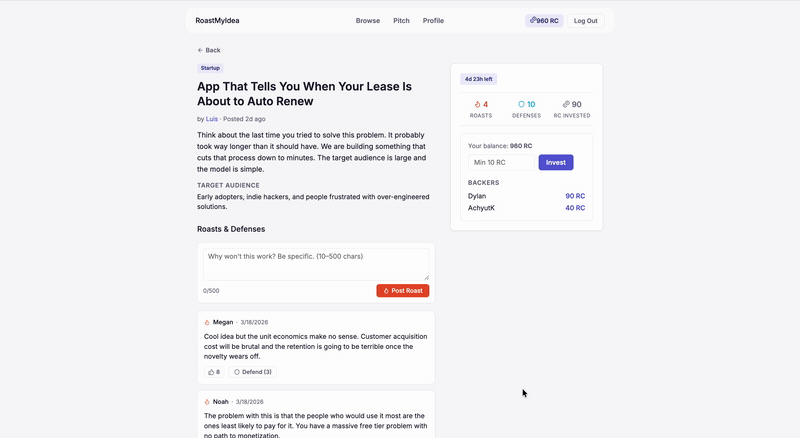

**Step 6: Post a defense.** Click "Defend" under any roast to counter it. Write a defense of at least 10 characters and click Defend. You cannot defend against your own roast.

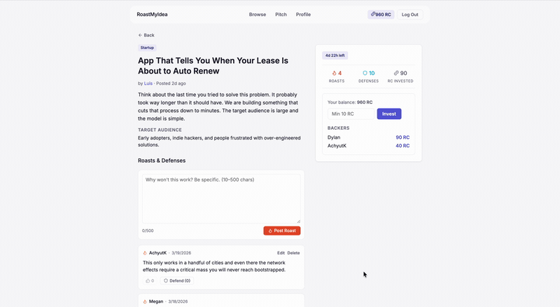

**Step 7: Upvote.** Click the thumbs up on any roast or defense to upvote it. Upvote counts influence the final verdict when the 7-day window closes.

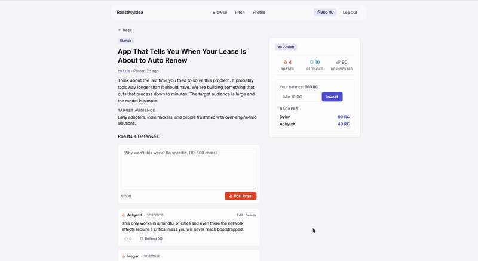

**Step 8: Pitch your own idea.** Click "+ Pitch Your Idea" on the browse page. Fill in the title, pitch, optional problem statement and target audience, and choose a category. Click Submit Pitch.

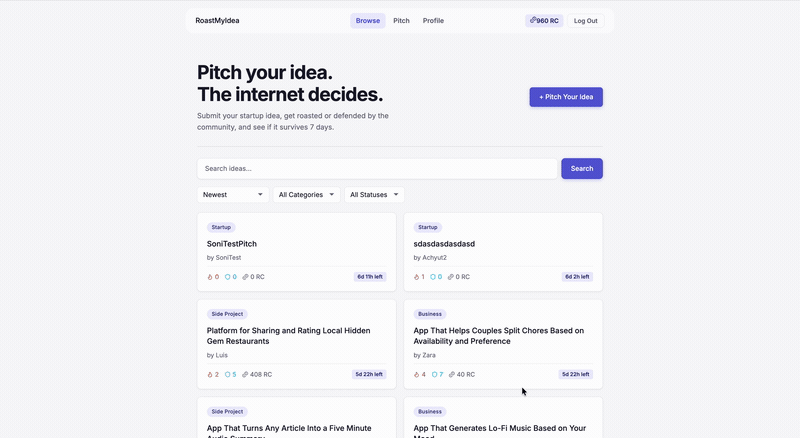

**Step 9: View your profile.** Click Profile in the navbar to see your stats, title badges, RC balance, and investment history.

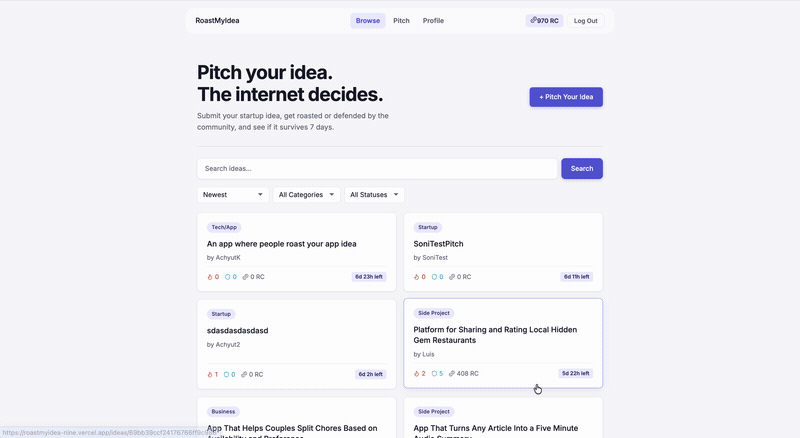

## Instructions to Build

1. Clone the repository

```bash
git clone https://github.com/Achyut21/roastmyidea.git
cd roastmyidea
```

2. Install backend dependencies

```bash
npm install
```

3. Install frontend dependencies

```bash
cd client && npm install --include=dev && cd ..
```

4. Set up environment variables

```bash
cp .env.example .env
```

Edit `.env` and fill in:

```
MONGODB_URI=your_mongodb_atlas_connection_string
JWT_SECRET=your_jwt_secret
```

5. Seed the database

```bash
npm run seed
```

This seeds 30 users, 150 ideas, ~400 backs, ~600 roasts, and ~1050 defenses (2200+ total records). All seeded users have password `password123`.

6. Run the backend locally

```bash
npm run dev
```

7. Run the frontend locally (separate terminal)

```bash
cd client && npm run dev
```

The frontend will be at `http://localhost:5173` and the API at `http://localhost:3000`.

## API Endpoints

### Auth

| Method | Endpoint             | Description            | Auth |
| ------ | -------------------- | ---------------------- | ---- |
| POST   | `/api/auth/register` | Create a new user      | No   |
| POST   | `/api/auth/login`    | Log in and receive JWT | No   |
| GET    | `/api/auth/me`       | Get current user info  | Yes  |

### Ideas

| Method | Endpoint         | Description                                                                                                           | Auth |
| ------ | ---------------- | --------------------------------------------------------------------------------------------------------------------- | ---- |
| GET    | `/api/ideas`     | Get ideas with pagination, filtering, and search (`?sort=`, `?category=`, `?status=`, `?q=`, `?lastId=`, `?lastVal=`) | No   |
| GET    | `/api/ideas/:id` | Get a single idea                                                                                                     | No   |
| POST   | `/api/ideas`     | Create a new idea                                                                                                     | Yes  |
| PUT    | `/api/ideas/:id` | Update an idea (author only)                                                                                          | Yes  |
| DELETE | `/api/ideas/:id` | Delete an idea (author only)                                                                                          | Yes  |

### Roasts

| Method | Endpoint                 | Description                  | Auth |
| ------ | ------------------------ | ---------------------------- | ---- |
| GET    | `/api/ideas/:id/roasts`  | Get all roasts for an idea   | No   |
| POST   | `/api/ideas/:id/roasts`  | Post a roast                 | Yes  |
| PUT    | `/api/roasts/:id`        | Edit a roast (author only)   | Yes  |
| DELETE | `/api/roasts/:id`        | Delete a roast (author only) | Yes  |
| POST   | `/api/roasts/:id/upvote` | Toggle upvote on a roast     | Yes  |

### Defenses

| Method | Endpoint                   | Description                    | Auth |
| ------ | -------------------------- | ------------------------------ | ---- |
| GET    | `/api/roasts/:id/defenses` | Get all defenses for a roast   | No   |
| POST   | `/api/roasts/:id/defenses` | Post a defense                 | Yes  |
| PUT    | `/api/defenses/:id`        | Edit a defense (author only)   | Yes  |
| DELETE | `/api/defenses/:id`        | Delete a defense (author only) | Yes  |
| POST   | `/api/defenses/:id/upvote` | Toggle upvote on a defense     | Yes  |

### Backs (Investments)

| Method | Endpoint               | Description                       | Auth |
| ------ | ---------------------- | --------------------------------- | ---- |
| GET    | `/api/ideas/:id/backs` | Get all backers for an idea       | No   |
| POST   | `/api/ideas/:id/back`  | Invest RoastCoin in an idea       | Yes  |
| GET    | `/api/users/:id/backs` | Get investment history for a user | Yes  |

### Users

| Method | Endpoint                 | Description                           | Auth |
| ------ | ------------------------ | ------------------------------------- | ---- |
| GET    | `/api/users/:id/profile` | Get a user's public profile and stats | No   |

## MongoDB Collections

1. **users** — Stores registered users
   - `_id` : ObjectId
   - `displayName` : String (unique)
   - `email` : String (unique)
   - `password` : String (bcrypt hashed)
   - `roastCoinBalance` : Number
   - `stats` : Object (ideasPitched, roastsWritten, defensesWritten, ideasFireproof, ideasTorched, totalRcInvested)
   - `titles` : Object (roaster, defender, pitcher)
   - `createdAt` : Date

2. **ideas** — Stores pitched ideas
   - `_id` : ObjectId
   - `authorId` : ObjectId (reference to users)
   - `title` : String
   - `pitch` : String
   - `problem` : String (optional)
   - `targetAudience` : String (optional)
   - `category` : String
   - `roastCount` : Number
   - `defenseCount` : Number
   - `totalRoastCoinInvested` : Number
   - `verdict` : String (null, fireproof, torched, lukewarm)
   - `createdAt` : Date

3. **roasts** — Stores roast comments on ideas
   - `_id` : ObjectId
   - `ideaId` : ObjectId
   - `authorId` : ObjectId
   - `content` : String
   - `upvotedBy` : Array of ObjectIds
   - `upvoteCount` : Number
   - `defenseCount` : Number
   - `deleted` : Boolean
   - `createdAt` : Date

4. **defenses** — Stores defenses on roasts
   - `_id` : ObjectId
   - `ideaId` : ObjectId
   - `roastId` : ObjectId
   - `authorId` : ObjectId
   - `content` : String
   - `upvotedBy` : Array of ObjectIds
   - `upvoteCount` : Number
   - `deleted` : Boolean
   - `createdAt` : Date

5. **backs** — Stores RoastCoin investments
   - `_id` : ObjectId
   - `ideaId` : ObjectId
   - `backerId` : ObjectId
   - `amount` : Number
   - `createdAt` : Date

## Gen AI Usage

**Model**: Claude

**Prompt 1:** "How do I implement keyset pagination with a compound sort in MongoDB so that switching sort fields (createdAt, roastCount, etc.) still produces stable, consistent pages?"

**Prompt 2:** "What is the correct way to set up Passport.js with both a LocalStrategy for login and a JwtStrategy for protecting routes in an Express ESM project?"

**Prompt 3:** "How should I structure a $text index on multiple fields with different weights so that title matches rank higher than pitch body matches in MongoDB full-text search?"
